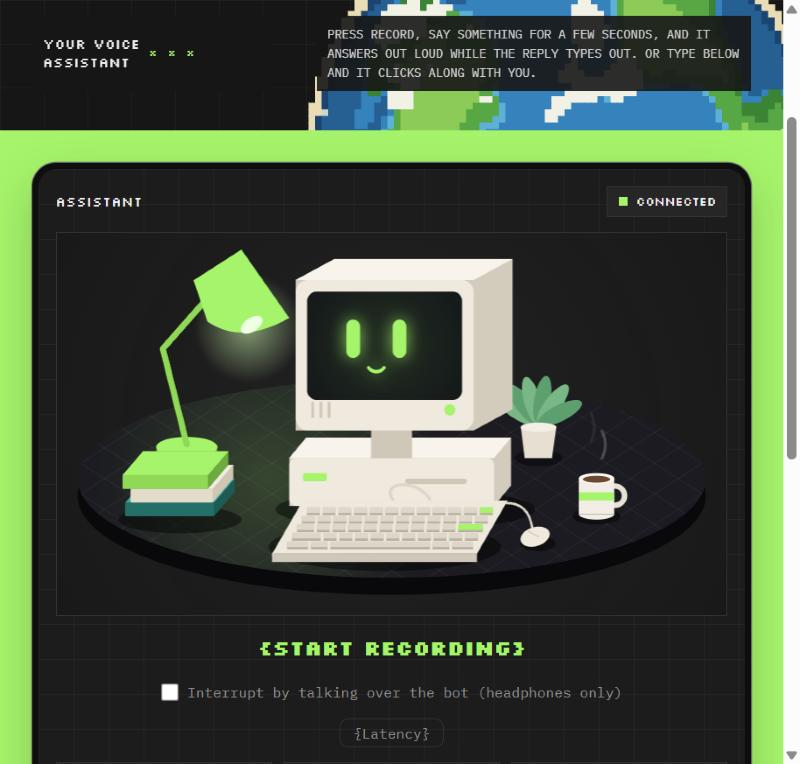
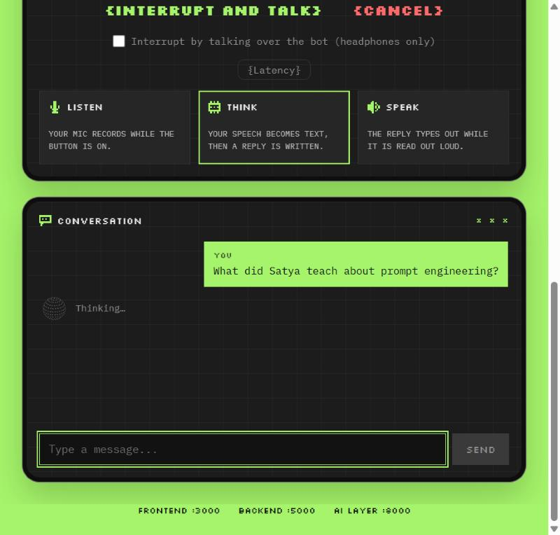
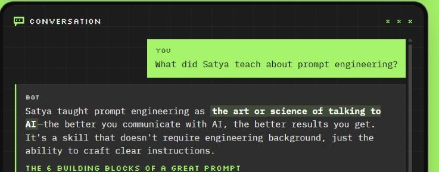
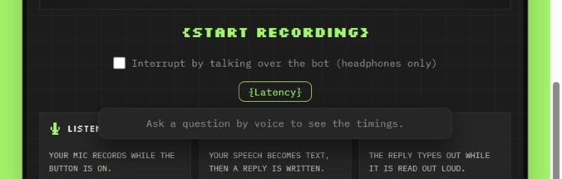

# Talk to Harvey — Real-Time Speech Conversation Bot

A voice assistant for the **ReveloSoft AI Engineer Bootcamp**, built on **Retrieval-Augmented Generation (RAG)**. Ask it a question out loud or type it, and it searches the bootcamp's own class recordings and notes for the relevant passages, then answers from those passages, speaking its reply back one sentence at a time while you can still interrupt it mid-answer.


---

## Key highlights

- **RAG, not raw LLM knowledge.** Every answer is grounded in the bootcamp's own material — class recordings and notes split into chunks, embedded, and searched with FAISS — so the bot answers from what was actually taught, not from the model's general training.
- **Voice in, voice out, in real time.** Speech-to-text, retrieval, the LLM reply and text-to-speech all happen over one live WebSocket connection, not a request/response round trip.
- **Speaks while it's still thinking.** The LLM's reply is streamed and cut into sentences as they finish, so the first sentence is already being spoken while later ones are still being written.
- **You can interrupt it.** Press Stop, or just talk over it with headphones on — the bot cancels mid-sentence and listens for your next question.
- **Three-layer architecture.** A React frontend, a Node/Express relay, and a Python FastAPI AI layer, each with one job and talking to the others only over WebSocket.
- **Measures its own speed.** A built-in latency panel times every step of a reply — speech-to-text, search, first word, first sentence, first voice clip — so slowness can be traced to one stage instead of guessed at.

## What it does

- **Ask by voice or by typing.** Press record and talk, or type in the chat box.
- **Grounded, RAG-based answers.** Replies come only from the bootcamp's class recordings and notes, searched with a RAG pipeline (FAISS + sentence embeddings) — not the model's general knowledge.
- **Speaks as it thinks.** The reply streams in from the LLM, is cut into sentences, and each sentence is spoken as soon as it is ready — no waiting for the whole answer.
- **Barge-in.** Interrupt the bot by pressing Stop, or by talking over it with headphones on.
- **Built-in timing.** A hidden `{Latency}` panel breaks down every step — speech-to-text, search, first word, first sentence, first voice clip — so slowness can be traced to one stage.

## Architecture

```
                 You (voice or typed text)
                           |
                           v
         ┌─────────────────────────────────┐
         │   Frontend — React + TS  :3000   │
         │  mic capture · chat UI · mascot  │
         └────────────────┬─────────────────┘
                           │ WebSocket
                           v
         ┌─────────────────────────────────┐
         │  Backend — Node + Express  :5000 │
         │     a thin relay to the AI layer │
         └────────────────┬─────────────────┘
                           │ WebSocket
                           v
         ┌─────────────────────────────────┐
         │   AI layer — FastAPI (Python) :8000
         │                                   │
         │  Deepgram  ──► speech to text     │
         │  FAISS + sentence embeddings ──► search the knowledge base
         │  LLM (streamed) ──► writes the reply, sentence by sentence
         │  ElevenLabs ──► text to speech, per sentence
         └───────────────────────────────────┘
```

- **Frontend** never talks to the AI services directly — only to the backend, over one WebSocket.
- **Backend** is a relay: it enforces nothing on its own and keeps all service keys out of the browser.
- **AI layer** does the real work: speech-to-text, retrieval, the LLM call, and text-to-speech, and streams partial results back the whole time.

## Tech stack

| Layer | Tech |
|---|---|
| Frontend | React, TypeScript, Canvas (hand-drawn mascot animation) |
| Backend | Node.js, Express, WebSocket relay |
| AI layer | Python, FastAPI, WebSockets |
| Speech | Deepgram (speech-to-text), ElevenLabs (text-to-speech) |
| Knowledge / RAG | LangChain text splitting, FAISS vector search, sentence-transformers embeddings |
| LLM | Claude (Anthropic), called in streaming mode |

## Running it locally

You'll need Node.js, Python 3.12, and API keys for Anthropic, Deepgram and ElevenLabs.

```bash
# 1. AI layer
cd ai-layer
pip install -r requirements.txt
cp .env.example .env   # fill in your real keys
python app.py          # http://localhost:8000

# 2. Backend
cd backend-layer
npm install
cp .env.example .env
npm start               # http://localhost:5000

# 3. Frontend
cd frontend-layer
npm install
npm start               # http://localhost:3000
```

Open `http://localhost:3000`, allow microphone access, and press `{start recording}`.

## Project structure

```
Real_Time-Speech_conversation_Bot/
├── frontend-layer/    React + TypeScript chat and voice UI
├── backend-layer/     Node/Express WebSocket relay
├── ai-layer/          FastAPI service: STT, RAG, LLM streaming, TTS
└── docs/screenshots/  README images
```

## See it in action

| Idle, listening for you | Thinking it through |
|---|---|
|  |  |

**Chat with a grounded, typed-out answer:**



**Latency panel, hidden until you hover it:**


